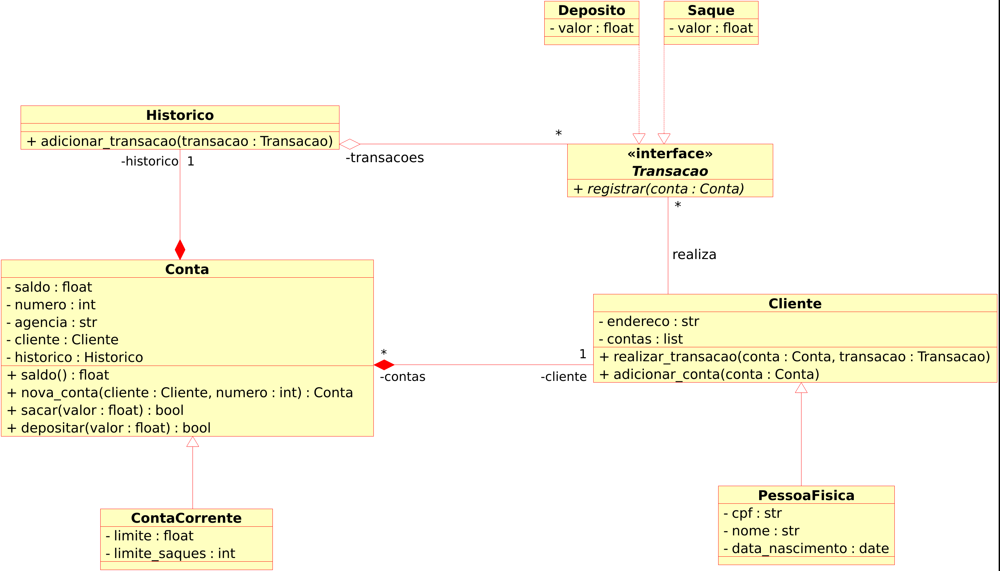

# DIO Bootcamp: NTT DATA

Repositório destinado às atividades propostas pelo Bootcamp NNT DATA de Engenharia de Dados da DIO.

### Guia

Os desafios/exercícios listados a seguir foram resolvidos e posteriormente corrigidos com os gabaritos disponibilizados pela DIO. Neles constam comentários e anotações feitos por mim para fixação do assunto.

1 - [Desafio Conta Bancária em Python](Desafio1-Conta_bancaria/desafio1.py.py) é o primeiro desafio do bootcamp, para exercitar os fundamentos da linguagem Python.

2 - [Desafio Estrutura de Dados](Desafio2-ED/desafio2.py) exercita o uso de funções e estruturas de dados em Python.

3 - [Desafio Sistema Bancário com POO](Desafio3-Sistema_bancario_POO/desafio3.py) exercita os conceitos de Programação Orientada à Objetos com Python. Foi proposto a implementação do diagrama de classes abaixo:

4 - No seguinte link consta as atividades relacionadas a [Processamento digital de imagens](https://github.com/Moskbr/image-processing-package.git) com Python, que também exercita a criação de pacotes no [Pypi](https://pypi.org/). A fim de registro, os procedimentos para criação de pacotes são:

- Diretório raíz com estrutura pré-definida para pacotes, com arquivos `README.md`, `requirements.txt` e `setup.py`.
- Usar `Twine` para criação do pacote com o comando: `python setup.py sdist bdist_wheel`
- 

